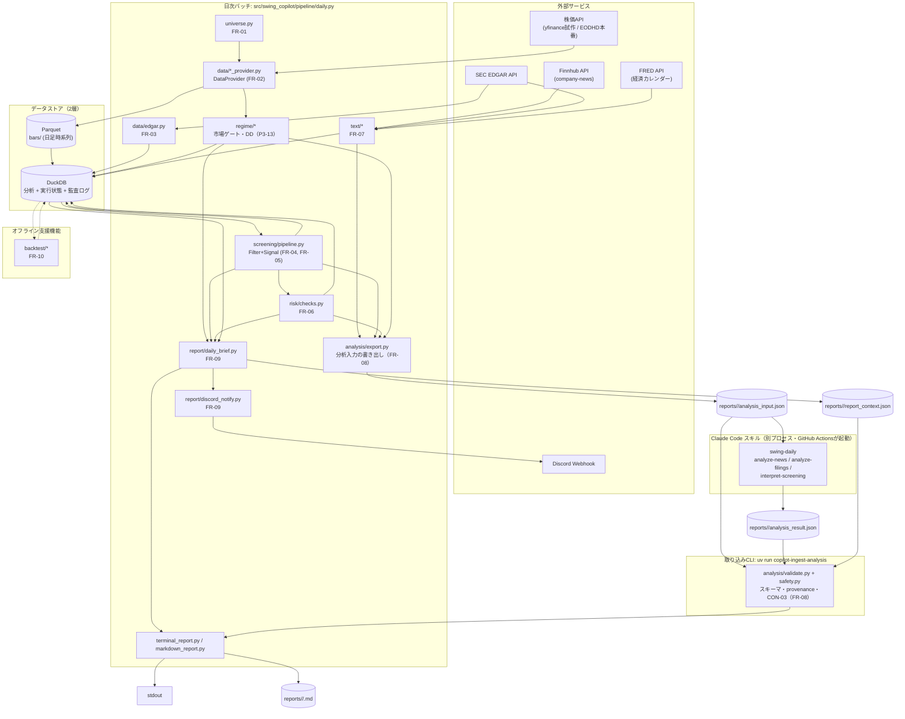
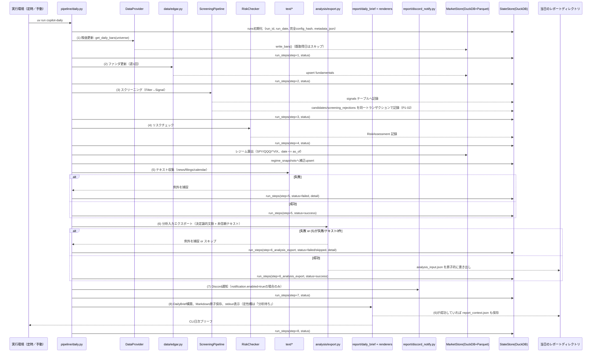
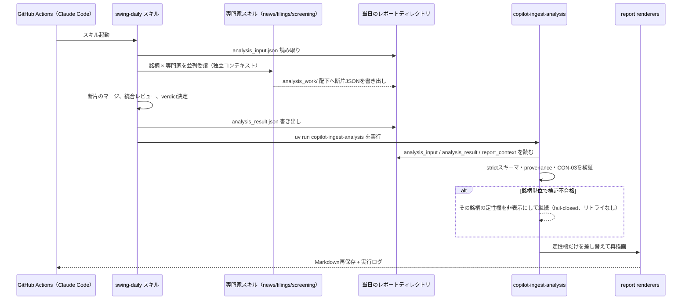

# 03. 基本設計書（swing-copilot）

## 1. 文書情報

| 項目 | 内容 |
|---|---|
| システム名（仮称） | swing-copilot |
| 対象範囲 | 米国株スイング〜ポジショントレードの意思決定支援システム（日次バッチ）。売買判断・発注は人間が行う。完全自動売買・証券会社API連携はスコープ外（CON-01）。 |
| 読者 | 本システムの詳細設計・実装を行う開発者・実装エージェント（Claude Codeの `/goal` による自律実装を含む） |
| 前提文書 | `docs/00_human_preparation.md`（人間の下準備）、`docs/01_requirements.md`（要件定義書、FR/NFR/CONのID定義元） |
| 後続文書 | `docs/04_detailed_design.md`（詳細設計書。本書のコンポーネント設計をモジュール・クラス・スキーマレベルまで具体化する） |
| バージョン | v1.3 |
| 最終更新日 | 2026-07-28 |

本書は要件定義書（`docs/01_requirements.md`）で定義された要件ID（FR-01〜FR-12、NFR-01〜NFR-07、CON-01〜CON-04）を前提とし、それらを満たすシステム構成・データフロー・データストア・外部インターフェース・エラー処理方針・運用設計・セキュリティ設計を定める。要件そのものの再定義は行わない。

文書の役割は、要件・制約=`docs/01_requirements.md`、アーキテクチャ=`docs/03_basic_design.md`、実装契約=`docs/04_detailed_design.md`、現在のデータ/API形状=`models.py`/`storage/schema.py`/公開シグネチャ、実行状況=Git・テスト・CIとする。`docs/goal-prompts/**`は特定の無人実行を支援する履歴資料であり、恒久設計の正本ではない。正本同士が矛盾した場合は暗黙に一方を選ばず、互換性を保ちながら差異を記録し、古い側を同じ変更で更新する。

---

## 2. システム全体構成

swing-copilotは、1日1回起動されるコマンド（平日は無人の定時実行、随時は手動実行）を起点に、価格・ファンダメンタルズ・テキスト情報を収集し、スクリーニング・リスクチェックを経てCLI日次ブリーフと監査用Markdownを生成する、単一プロセスのバッチパイプラインである。定性分析（ニュース解釈・開示解釈・スクリーニング評価）はこのプロセスの外にあり、日次バッチが書き出した`analysis_input.json`をClaude Codeスキルが読み、その回答を`copilot-ingest-analysis`が検証してレポートへ反映する。Discord通知はオプションであり、自動発注は行わない。

採用するアーキテクチャパターンは次の通り。

- **モジュラーモノリス**: 配布・実行単位は1つのPythonパッケージ/CLIとする。機能別モジュール境界は保つが、プロセス分割・メッセージブローカー・常駐サービスは導入しない。
- **Functional Core / Imperative Shell**: 指標、Filter、Signal、候補順位、リスク計算、バックテスト約定規則は、`as_of`と入力データを受け取る決定的な純粋ロジックに置く。`pipeline/daily.py`は外部API・clock・ストア・通知を調停する薄いimperative shellとする。
- **Ports & Adapters（境界限定）**: 変更可能性または障害可能性が高い`DataProvider`、テキスト取得、Notifier、clockだけをProtocolで抽象化する。内部モジュール同士を機械的にinterface化しない。定性分析はプロセス内のポートではなく、ファイル（JSON）を介したプロセス外の境界とする。
- **Repository + step Unit of Work**: `MarketStore`/`StateStore`は同じDuckDBを使う論理repositoryとし、日次バッチの各ステップをトランザクション境界にする。Parquetを跨ぐ処理は自然キーupsertと原子的renameで再実行可能にする。
- **明示的composition root**: CLI起動時に設定から具体adapterを組み立てて注入する。import副作用による自動検出やentry-point plugin探索はP1〜P2では行わない。

この構成は、1人保守・常時稼働サーバーなしというNFR-02に対して、外部サービス差し替えとテスト容易性だけを確保し、分散システムの運用負荷を持ち込まないための選択である。

日次実行は平日1回、GitHub Actions上で`uv run copilot-daily`を無人起動する（ローカルからの手動実行も同じコマンド。8.1節）。`data/`（Parquet/DuckDB）の正本はCloudflare R2にあり、実行の前後で取得・書き戻す（8.2節）。`reports/`（生成Markdown）は実行環境に残る成果物である。記録済みのrun・候補・落選を後から閲覧する読み出し専用CLIとして`uv run copilot-history`がある（roadmap P1-05、`docs/04_detailed_design.md` 3.22節）。実売買記録機能（旧`copilot-decision`、旧`performance`サブコマンド）は2026-08に公開トラックレコード化に伴い撤去した。

---

## 3. コンポーネント一覧（責務・対応FR）

| コンポーネント | 主な配置 | 責務 | 対応FR/NFR |
|---|---|---|---|
| Universe管理 | `universe.py` | S&P500構成銘柄のCSVキャッシュとDuckDB履歴の取得・保存・更新。`as_of`時点で可視な履歴選択、live更新周期、フォールバック警告を一元化する | FR-01 |
| DataProvider | `data/base.py`, `data/yfinance_provider.py`, `data/eodhd_provider.py` | 日足株価の取得を抽象化し、試作(yfinance)・本番(EODHD)を差し替え可能にする | FR-02, NFR-07, CON-02 |
| EDGARクライアント | `data/edgar.py` | SEC EDGAR公式APIから財務諸表・ファンダメンタルズを取得 | FR-03 |
| Database | `storage/database.py` | 単一DuckDB接続・スキーマ初期化・トランザクション境界 | NFR-02, NFR-05 |
| MarketStore | `storage/market_store.py` | 日足時系列（Parquet）・ファンダメンタルズ・分析クエリ（DuckDB）の読み書き | FR-02, FR-03 |
| StateStore | `storage/state_store.py` | 実行、候補、リスク評価、収集テキスト、verdictと仮想ポジション追跡を同じDuckDBへ保存 | NFR-05 |
| Filter/Signal基盤 | `screening/base.py` | フィルタ・シグナルのABCとプラガブルな登録レジストリ | FR-05, NFR-07 |
| ファンダフィルタ | `screening/fundamental_filters.py` | 第1段: 黒字継続・FCF・自己資本比率によるユニバース絞り込み | FR-04 |
| テクニカルシグナル | `screening/technical_signals.py` | 第2段: pandasで算出するトレンド・押し目・Minervini Stage 2シグナル評価 | FR-05, P5-21 |
| ScreeningPipeline | `screening/pipeline.py` | `strategies.yaml`に従いフィルタ・シグナルをAND合成し、決定的に順位付けした候補を出力 | FR-04, FR-05, NFR-07 |
| 市場レジーム | `regime/gate.py`, `regime/distribution.py`, `regime/ftd.py` | SPY/QQQ/^VIXの`as_of`までのOHLCVから市場ゲート・Distribution Day・表示専用FTD状態機械を決定論的に算出し、データ不足時はUNKNOWNへ安全側に倒す | P3-13, P3-16 |
| RiskChecker | `risk/` | ポジションサイズ・セクター集中度・銘柄間相関・ポートフォリオヒートのリスクチェック。Exposure CeilingがCASH_PRIORITYなら新規株数を0、REDUCE_ONLYなら取引リスク枠を縮小する。ヒートは保有と承認候補をランキング順に累積し、上限超過候補を拒否する | FR-06, P3-14, P4-17 |
| 決算カレンダー | `data/earnings.py`, `data/earnings_finnhub.py` | Finnhubの決算予定を明示タイムアウト・有界リトライ・全試行レート制限で取得し、候補の2/5営業日block/warn判定へ渡す。キー未設定・取得失敗はfail-softで明示する。明示`--as-of`では当時の公表状態を復元できない現在値APIを呼ばず、予定不明へ縮退する | P4-18 |
| サーキットブレーカー | `risk/circuit_breaker.py` | 実現損益をETの日次・週次・月次境界で再集計し、損失上限または連敗後24時間に該当する間は新規候補を拒否する。日次パイプラインでは実売買記録機能の撤去（2026-08-19）により入力が存在せず常に未評価（`None`）で、バックテストが自身の実現損益で評価するときだけ機能する（`backtest/policy.py`） | P4-19 |
| テキスト収集 | `text/` | ニュース（Finnhub）・適時開示（EDGAR 8-K/10-Q）・経済カレンダー（FRED）の収集 | FR-07 |
| 分析スキーマ | `analysis/schemas.py` | `analysis_input.json`/`analysis_result.json`双方のstrict pydanticスキーマ（`extra="forbid"`）。`SourcedFact.source_ids`は1件以上必須、`SourcedFact.evidence_quote`は自身が引用する`source_ids`の本文からの逐語引用が必須 | FR-08, CON-03 |
| 分析文脈整形 | `analysis/context.py` | コード計算済みのスコア内訳・リスク制約・市場レジーム・実績サマリ・過去判断を、上書き不可の明示付きで不活性テキストへ整形する純関数群 | FR-08, P2-12, P3-15 |
| 分析入力エクスポート | `analysis/export.py` | 上記文脈と収集済み未信頼テキストを`analysis_input.json`として日付付きレポートディレクトリへ原子的に書き出す。モデルを呼ばない | FR-08 |
| ブリーフスナップショット | `analysis/snapshot.py` | 再描画のため`DailyBrief`・run status・出力先と入力束縛を`report_context.json`（schema `report-context-v3`）へ保存/復元する。読み取り時に`schema_version`を検証し、世代不一致は復旧手段付きで`AnalysisIngestError`にする | FR-08, NFR-05 |
| 分析結果検証 | `analysis/validate.py` | スキル出力を信頼せず、strictスキーマ・provenance（`source_ids` ⊆ 当該銘柄の供給ID）・CON-03を検証し、違反銘柄を銘柄単位でfail-closedに縮退させる | FR-08, CON-03 |
| CON-03検査 | `analysis/safety.py` | 断定的売買指示・根拠なき心理/行動診断を全ユーザー表示テキストから検出する純関数（旧`llm/safety.py`） | CON-03 |
| 分析取り込みCLI | `analysis/cli.py` | `copilot-ingest-analysis`。3つのJSONだけを読み、検証を通った定性欄でレポートを再描画する。ネットワーク・スクリーニング再計算なし | FR-08, FR-09 |
| 定性分析スキル | `.claude/skills/swing-daily` ほか | `analysis_input.json`を読み、ニュース/開示/スクリーニングの専門家スキルへ並列委譲し、統合レビューとverdict決定を経て`analysis_result.json`を書く（本リポジトリのPythonパッケージ外、GitHub Actionsから起動） | FR-08 |
| 日次ブリーフ構築 | `report/daily_brief.py` | 市場・候補・リスク・検証済み定性分析を表示非依存の値へ集約 | FR-09 |
| CLI/Markdown出力 | `report/terminal_report.py`, `report/markdown_report.py` | stdout表示とrun ID単位の原子的Markdown保存 | FR-09, NFR-05 |
| Discord通知 | `report/discord_notify.py` | Discord Webhookへの通知送信（デフォルト有効） | FR-09 |
| バックテスト | `backtest/` | 日次ロジックを再利用する複数銘柄ポートフォリオシミュレータ、SPY買い持ちとの比較 | FR-10 |
| 日次オーケストレータ | `pipeline/daily.py` | 全ステップの実行順制御・冪等性・フェイルソフト | FR-12, NFR-04 |
| 設定ロード | `config.py` | `settings.yaml`/`strategies.yaml`/環境変数の統合ロード | NFR-06 |

---

## 4. データフロー（日次バッチのシーケンス）

`pipeline/daily.py` は以下の8ステップを固定順で実行する。起動時に一意な`run_id`を発行し、`run_date`は取得済み日足の最新取引日または明示された`--as-of`から決める。ステップ(5)テキスト収集・(6)分析入力エクスポートが失敗しても、ステップ(8)はスクリーニング結果のみの縮退版を出力する。同じ`run_date`の再実行でも業務データを重複させず、実行履歴は別`run_id`で残す。

明示`--as-of`は、履歴正本を持つ価格・財務・filing・ユニバースだけを時点選択する。
決算予定の現在値と現在のオープンポジションは、後日取得・記録した情報を過去へ
持ち込む可能性があり、当時の状態を復元できる監査履歴もない。そのため両方を参照せず
「不明」として警告へ明示し、ポジション依存の保有銘柄追加・リスク文脈・MAE/MFE更新を
行わない。通常実行（`--as-of`なし）は従来どおり現在状態を利用する。

定性分析そのものはこのシーケンスに含まれない。ステップ(6)は`analysis_input.json`を書き出すだけであり、モデルを一切呼ばないため常に安全かつ低コストに実行できる。日次バッチが出すレポートの定性欄は常に「分析待ち」である。分析はこの後、Claude Codeスキルと`copilot-ingest-analysis`が担う（下記の第2シーケンス）。

日次バッチ完了後、GitHub Actions の `swing-daily.yml` job が `swing-daily` スキルを
起動すると以下が続く。この経路はDuckDBへ書き込まず、データ同期以外のネットワークにも
接続しない。定性分析スキルは CI でのみ実行する。

---

## 5. データストア設計（2層の使い分け）

swing-copilotは目的別に2層のデータストアを使い分ける。単一プロセス・単一利用者であるため、SQLiteとDuckDBへ構造化状態を分散させない。

| 層 | 実体 | 役割 | 主な利用者 |
|---|---|---|---|
| ① Parquet | `data/bars/`（`year=YYYY`パーティション） | 日足時系列の生データを列指向で永続化。追記・大量読み出しに強い。 | DataProvider（書き込み）、DuckDB（読み出し元） |
| ② DuckDB | `data/copilot.duckdb` | Parquetへのビュー、ファンダメンタルズ、ユニバース履歴、実行/ステップ、候補、落選理由、リスク評価、収集テキスト、verdict/仮想ポジションを保持する唯一の構造化ストア。 | screening/*, risk/*, tracking/*, report/*, pipeline/*, backtest/* |
| ③ JSONアーティファクト | `reports/<run_date>/` | 定性分析の入出力（`analysis_input.json`／`analysis_result.json`）と再描画用の`report_context.json`。DuckDBには入れない——プロセス外のスキルが読み書きする受け渡しファイルであり、同時にそのまま監査証跡になる（NFR-05）。落選明細の`rejections.json`（`report/rejections.py`）も同じディレクトリに並べる。こちらはDuckDBの`screening_rejections`の写しに加え、台帳の閉じたenumでは表現できない`candidate_limit`切り捨て分を持つ。 | analysis/*, report/*, Claude Codeスキル |

使い分けの原則:
- **時系列の大量データ（株価）はParquet**に列指向で永続化し、DuckDBはその上の「クエリビュー」として振る舞う（DuckDB自体に生データを二重persistしない）。
- **ファンダメンタルズとアプリ状態はDuckDBのテーブル**として直接保持し、同じ`run_id`に紐づけてレポート入力を再構成できるようにする。
- DuckDB内の論理責務は`MarketStore`と`StateStore`へ分けるが、物理DBと接続/トランザクション管理は`storage/database.py`へ一元化する。
- ParquetとDuckDBは`data/`配下に配置し、ローカルファイルシステムへ永続化する。Parquet更新とDuckDB更新を跨ぐ分散トランザクションは行わず、ステップ単位の原子的書き込みと再実行可能なupsertで回復する。
- 定性分析のJSONアーティファクトは`reports/<run_date>/`配下へ、宛先と同じディレクトリの一時ファイル＋`os.replace()`で原子的に書く。失敗時は以前の宛先を保ち、一時ファイルを残さない（Markdown/Parquetと同じ置換規約）。

---

## 6. 外部インターフェース一覧

### 6.1 データ取得系 外部API（4つ）＋Discord通知

| # | サービス | 用途 | エンドポイント種別 | 認証 | レート制限 |
|---|---|---|---|---|---|
| 1 | 株価API（yfinance試作 / EODHD本番） | 日足OHLCV取得 | yfinance: 非公式ライブラリ経由（キー不要）。EODHD: REST API（$19.99/月プラン） | yfinance: なし。EODHD: APIキー（クエリパラメータ、実装時に要確認） | yfinance: 明示的なSLAなし（過度な連打は避ける）。EODHD: プラン依存（実装時に要確認） |
| 2 | SEC EDGAR API | 財務諸表・ファンダメンタルズ、8-K/10-Q監視 | 公式REST API（edgartools経由） | 不要（ただしUser-Agentヘッダー必須: 氏名/アプリ名＋連絡先メールアドレス） | 10リクエスト/秒上限 |
| 3 | Finnhub API | ニュース収集（company-newsエンドポイント） | 公式REST API | APIキー（無料枠） | 60コール/分 |
| 4 | FRED API | 経済カレンダー・指標 | 公式REST API | APIキー（無料） | 明示的なSLAなし（実装時に要確認、常識的な間隔を空ける） |
| － | Discord Webhook | 日次レポート通知（デフォルト有効。無人実行の結果を知る主経路であり、有効なままWebhook URLが無い実行は設定エラーで止まる） | Webhook POST | Webhook URL自体が認証情報 | Discord側のWebhookレート制限（実装時に要確認） |

現行の価格providerは`yfinance`であり、全runのdata tierは`prototype`である。`prototype`の最終CLIブリーフとMarkdownには「非公式データに基づく試作結果」を必ず表示する。本番tierはまだ実装していないため、起動モードの追加や曖昧な本番切替は行わない。

### 6.2 Claude Codeスキル境界（定性分析）

定性分析はネットワーク越しのAPIではなく、**ローカルファイルを介したプロセス外境界**である。本プロセスからLLM APIを呼ばないため、APIキー・タイムアウト・リトライ・レート制限・従量課金はいずれも存在しない。

| 項目 | 内容 |
|---|---|
| 用途 | ニュース解釈、開示（8-K/10-Q）解釈、スクリーニング結果の定性評価、銘柄ごとのverdict決定（FR-08） |
| 実行主体 | GitHub Actions の `swing-daily.yml` job。統括スキル`.claude/skills/swing-daily`が、`analyze-news`／`analyze-filings`／`interpret-screening`を独立コンテキストのサブエージェントへ並列委譲する。定性分析スキルの起動経路は CI のみで、Workflowツールは使わず Agent ツールの並列起動を標準とする（条件は`.claude/skills/swing-daily/SKILL.md`が定める） |
| 認証 | なし（APIキーを持たない）。GitHub Actions の Claude Code OAuth secret が実行権限を担う |
| 渡すもの | `reports/<run_date>/<run_id>/analysis_input.json`（schema `analysis-input-v3`）。決定論的な文脈ブロックと未信頼テキストをフィールドレベルで分離し、開示にはコード所有のcoverageを含む |
| 受け取るもの | `reports/<run_date>/<run_id>/analysis_result.json`（schema `analysis-result-v3`。旧`analysis-result-v2`はP8アーカイブ読み込みだけ後方互換で受理し、新規runは`copilot-ingest-analysis`がhard failさせる）。スキルが書く唯一の成果物 |
| 信頼境界 | スキル出力は未信頼入力として扱う。`copilot-ingest-analysis`が3文書のstrict schema・run identity・provenance・CON-03を検証するまで、いかなる文字列もレポートへ出さない |
| 失敗時 | 銘柄単位でfail-closed（当該銘柄の定性欄を非表示にして継続、リトライなし）。`run_id`、`as_of`、`strategy_key`、input digest不一致・JSON破損・スキーマ違反は既存レポート不変のrun全体hard fail |
| 監査記録 | run専用ディレクトリに`analysis_input.json`／`analysis_result.json`／`report_context.json`をそのまま残す（NFR-05） |
| 未信頼テキストの分離 | ニュース・開示本文はスキーマ上の専用フィールド（`news[].summary`／`filings[].text`）に置き、コード計算済みの文脈は別フィールドの`<market_regime>`等のブロックに置く。本文が指示を含んでもコード側の判定を装えない |
| 開示の長文境界 | 1開示120,000字・1銘柄240,000字を上限とする。10-Q/10-Q-Aは財務諸表・MD&A・リスク要因・法的手続を章優先で構成し、抽出不能時だけ先頭スライスへ縮退する。配分を超える章は先頭と末尾の両方を残し、境界に省略マーカーを置く（末尾の注記・Results of Operationsを無言で落とさない）。coverageで欠落を監査可能にする |
| マクロ/経済カレンダー情報 | symbolを持たない`TextItem`（`source_type="calendar"`）は候補ごとの`news`/`filings`ではなく、run単位の`context.calendar_events`に載る。provenance検証はこのIDをどの銘柄の分析からの引用も許容する（ニュース/開示IDは引き続き当該銘柄限定） |

---

## 7. エラー処理・フェイルソフト方針

- **フェイルソフトの原則（FR-12・NFR-04）**: ステップ(5)テキスト収集・(6)分析入力エクスポートが失敗しても、ステップ(8)は候補とリスクを含む縮退ブリーフを生成する。通知、`latest.md`更新、`report_context.json`保存が失敗しても、run固有Markdownが残る限りは`DEGRADED`・終了コード0とし、成果物パスを運用サマリへ表示する。
- **各ステップの結果記録**: `runs`に実行全体、`run_steps`に8ステップの成否・詳細・所要時間を記録する。(1)〜(4)、ブリーフ生成、またはrun固有Markdown保存の失敗は`FAILED`・非ゼロ終了とする。CLI終了時は一箇所にrun ID、status、exit code、provider/data tier、欠損source、成果物、次のread-only確認コマンドを表示する。
- **冪等性と原子性**: 同じ評価対象日を再実行しても、bars=`(symbol,date)`、fundamentals=`accession_no`、signals=`(run_date,symbol,strategy_key,signal_name)`、text=`source_id`を自然キーとして訂正可能なupsertを行う。成功済みという理由だけでステップ全体を無条件スキップしない。複数行の論理更新は1トランザクションとし、途中失敗時は全件rollbackする。snapshot再保存は消えた構成員も削除する。CSV/Parquet/reportの置換は宛先と同じディレクトリに一意な一時ファイルを作り、成功時だけ置換する。書き込みまたは置換に失敗した場合は旧宛先を保ち、一時ファイルを必ず除去する。（**P7（スキル移行）での変更**: 以前はLLM成功レスポンスを`(model,prompt_hash,schema_version)`一致で再利用するキャッシュ規約を置いていたが、LLM API呼び出しの廃止に伴いキャッシュ機構ごと削除した。定性分析の再実行はスキル側の冪等な再入手順（既存の`analysis_result.json`を勝手に上書きしない、当日の`as_of`を持つ作業断片だけを流用する）が担う。）（**live検証時の訂正（2026-07-22）、Issue #258で機構を更新**: fundamentalsステップ（`pipeline/daily.py` 2番目のステップ）は例外で、8.3節の増分リフレッシュ判定でスキップと決まった銘柄はEDGARへの個別ネットワーク取得のみをスキップする。ステップ自体・自然キーupsertロジックは無条件スキップせず毎回実行するため、上記原則には反しない。当初この例外は`MarketStore.has_fundamentals_fetched_on()`による同日再実行スキップだけを指していたが、8.3節の取得頻度規定との乖離を解消するためIssue #258で増分判定へ置き換えた——同日再実行のスキップは増分判定の「経過0日 < 7日」ケースとして引き続き成立する。この注記が扱うのはあくまで**無条件スキップ禁止原則の例外**であって、8.3節の取得頻度規定そのものではない。詳細は`docs/04_detailed_design.md` 3.21節）
- **欠損検知・リトライ（NFR-04）**: DataProvider・EDGAR/Finnhub/FREDクライアント等、外部I/Oを伴うコンポーネントはtimeout、retry対象例外、総試行上限、backoffを明示する。接続・タイムアウト・HTTP 408/429/5xxだけを一時障害として最大3回（1秒、2秒）再試行し、その他の4xx、設定/検証/プログラミングエラーは即時に失敗させる。レート制御がある境界は各試行へ適用する。個別銘柄の取得失敗はバッチ全体を止めず、失敗銘柄をリストとして返し、後続処理は成功分のみで進める。
- **断定的売買指示の禁止（CON-03）**: 分析結果スキーマは事実（`facts`）と解釈（`interpretation`）をフィールドレベルで分離する。スキルへの指示だけに依存せず、`copilot-ingest-analysis`（`analysis/validate.py`＋`analysis/safety.py`）が全ユーザー表示テキストを一元検査し、違反銘柄をレポートへ出さない。検証を通すための文言修正・再投入は規約違反であり、リトライしない（fail-closed）。

---

## 8. 運用設計

### 8.1 実行環境

| 環境 | 用途 | 実行方法 |
|---|---|---|
| GitHub Actions | 平日の日次実行（本番） | `.github/workflows/swing-daily.yml`。cron `17 1 * * 2-6`（UTC、= JST 火〜土 10:17。米国セッションの翌UTC日に走るため曜日は火〜土）と`workflow_dispatch`のみで起動し、R2から`data/`を取得 → `copilot-daily` → CI専用の`swing-daily`定性分析 → 成功時のみR2へ書き戻す。環境変数はGitHub Secrets |
| ローカルマシン | 決定論的パイプラインの開発・デバッグ・随時の手動実行 | `just data-pull`で`data/`を取得してから`uv run copilot-daily`等を実行し、書き込んだら`just data-push`で戻す（`.env`から環境変数をロード）。`swing-daily`定性分析はローカルでは実行しない |

決定論的なパイプラインは両環境で同じコードを動かす。定性分析だけは GitHub Actions
に限定し、ローカル実行の分岐をスキルへ持たせない。

### 8.2 永続化

データの正本はCloudflare R2のプライベートバケットであり、ワークスペースの`data/`はその作業コピーである。GitHub Actionsのランナーは実行ごとに破棄されるため、**永続化はR2への書き戻しで完了する**。同期は`scripts/data_sync.py`（`pull`／`push`／`status`、justfileの`data-pull`／`data-push`／`data-status`）が担い、DuckDBファイルは常にバイト列として転送する（同期のためにDuckDBとして開かない）。

- 同期対象（R2が正本）: `data/`（Parquet: `bars/`、DuckDB: `copilot.duckdb`）。`copilot_dry_run.duckdb`と`*.bak-*`は同期しない
- 同期対象外（ローカル／ランナー限り）: `reports/<run_date>/<run_id>.md`（run別生成Markdown）、`reports/latest.md`（最新runの便宜コピー）。GitHub Actions上の実行はこれをworkflow artifactとして保存する
- 並行書き込みガードは`manifest.json`の単調増加`generation`による楽観ロックだけである。`push`はリモートのgenerationが`pull`時点と一致するときにのみ成功するので、**書き込みを伴う作業はpull → 作業 → pushを1セットで行い、pullしたまま放置しない**
- 実行が失敗した日はpushしない。リモートの正本は前日のまま残り、翌runのプリフライトが欠落を検知する

### 8.3 実行時間

NFR-03「35分以内」を満たすため、各ステップの`duration_s`を`run_steps`に記録し、継続的にボトルネックを監視する。S&P500全銘柄（約500銘柄）に対する外部API呼び出しはレート制限（EDGAR 10req/秒、Finnhub 60コール/分）の制約を受けるため、以下の方針で時間短縮を図る（発注者確定仕様）。

- 価格取得: yfinanceの一括ダウンロード（500銘柄バッチ）を用い、銘柄ごとの個別リクエストを避ける。
- ファンダメンタルズ更新: 週1回、かつ前回取得以降に新規filingがある銘柄のみを対象とする増分更新とする。具体的には、(1) 取得記録が無い（初回）、(2) **鮮度地平**から7日以上経過、(3) 収集済みfilingメタデータ上で存在が分かっているfilingが、まだ`fundamentals`へ取り込まれていない（提出日から7日以内の**有界な再試行窓**。EDGARのcompany-facts公開ラグで空振りしても取り込みまで再試行する）——のいずれかを満たし、かつポーリング間隔の抑制に掛からない銘柄だけEDGARへ問い合わせる（**Issue #258で実装**。それまでは同日再実行の重複回避しか行っておらず、本規定と乖離していた）。`fundamentals_fetch_log`が持つ値はいずれも**メタデータ**であり`as_of`の代替ではない。鮮度地平は`min(壁時計, as_of)`で、過去日`--as-of`のリプレイが実運用の再取得を抑止しないようクランプし、かつ**レコードを返さなかった取得では進めない**（空振りの再試行がバックストップの起点をリセットしないため）。結果として**どの銘柄も7日を超えてポーリングされないままにはならない**。新規filingの判定にはステップ5が既に収集済みの`text_items`（`source_type='filing'`）と`fundamentals`の取り込み済み`filed_at`を使うので、**外部API呼び出しは増えない**。判定の詳細・境界・被覆の限界（トリガーが効くのはテキスト収集が既に触れた銘柄だけで、初めて候補になる銘柄には最大7日のドリフトが残る）は`docs/04_detailed_design.md` 3.21節を参照。

    !!! note "10-Kは増分トリガーを直接armしない（Issue #280）"
        ステップ5（テキスト収集）は`_FILING_FORM_TYPES`（`8-K`・`10-Q`）のみを収集し、10-K本文は
        収集対象外である。そのため10-Kそのものは`text_items`に現れず、上記(3)の新規filingトリガー
        をarmしない。実務上は10-Kに先行する決算8-K（Item 2.02）が収集されてトリガーをarmするため、
        多くの場合は問題にならない。仮に拾えなくても、あらゆる銘柄の鮮度上限は上記(2)の7日バックス
        トップで一律に担保されるため、10-Kだけが特別に遅れることはない。

        なお、新規filingトリガー自体は**フォーム非依存**である。`_FILING_FORM_TYPES`はテキスト収集
        の対象を絞るためだけに使われ、トリガーの判定条件には共有されていない。そもそも`text_items`
        テーブルに`form`列が無く（フォーム種別は`title`にしか現れない）、現状フォームで絞ること自体
        ができない。10-Kをテキスト収集へ追加する案・`fundamentals`の提出周期から決算日を射影する案は
        それぞれ収集スコープ拡大とEDGAR呼び出し増、大きな新規結合を伴うため見送り、現状維持を採用した
        （却下理由の詳細はPR説明を参照）。

- ニュース取得・分析入力エクスポート: 保有銘柄＋当日のスクリーニング候補銘柄の合計最大30銘柄に対象を限定する。定性分析自体は日次バッチの外で走るため、NFR-03の35分予算には含まれない。
- SEC EDGARアクセス: 10リクエスト/秒の上限を守るスロットリングを実装する。

実装後の実測に基づく追加チューニング（並列化要否等）は`docs/04_detailed_design.md`の該当モジュール（3.2, 3.4, 3.6, 3.14節）を参照。

### 8.4 監視

- 実行結果は`runs`/`run_steps`に記録し、レポート末尾へ`run_id`、評価対象日、データ鮮度、各ステップの状態と所要時間を表示する。
- 通知はレポート配信を兼ねた簡易な死活監視としても機能する（通知が来ない＝バッチ未完走のシグナルになる）。無人実行では結果を知る主経路がこれであるため、デフォルトで有効とする。

---

## 9. セキュリティ設計

- **APIキー管理（NFR-06）**: `FINNHUB_API_KEY`, `FRED_API_KEY`, `EDGAR_IDENTITY`, `DISCORD_WEBHOOK_URL` はすべて環境変数として扱い、ローカルの`.env`（`.gitignore`対象、python-dotenvで読み込み、`.env.example`に項目のみ記載）から読み込む。`DISCORD_WEBHOOK_URL`は通知が有効な限り必須であり、欠けている実行は縮退せず設定エラーで止まる。
- **コードへの秘密情報のハードコード禁止**: `settings.yaml`・`strategies.yaml`等の設定ファイルにはAPIキー・Webhook URLを直接記載しない。`config.py`（pydantic-settings）が環境変数を優先的に読み込む。
- **リポジトリの公開範囲**: GitHubリポジトリを利用する場合（コード管理用、利用自体は任意）はプライベートで運用する（`docs/00_human_preparation.md`項目5に対応）。
- **SEC EDGAR User-Agent**: 規約上必須のUser-Agentヘッダーには氏名またはアプリ名＋連絡先メールアドレスを設定する（個人情報の取り扱いに留意）。
- **分析アーティファクトの取り扱い**: `analysis_input.json`・`analysis_result.json`・`report_context.json`は`reports/<run_date>/`へ平文で残る（NFR-05の監査証跡）。入力に含まれるのは公開ニュース・公開開示・コード計算済みの値・自分自身の過去判断だけであり、APIキー等の秘密情報は含めない。`data/`と`reports/`はGit管理対象外とし、リポジトリがprivateでもDBファイル・分析アーティファクトをコミットしない。
- **監査性と秘密情報の分離**: `runs`・`run_steps`等の監査ログにAPIキー自体が記録されないよう、ログ出力箇所でシークレット値をマスクする実装方針とする（詳細は`docs/04_detailed_design.md`）。

---

## 10. 要件トレーサビリティ表

| 要件ID | 概要 | 対応コンポーネント |
|---|---|---|
| FR-01 | ユニバース管理 | `universe.py` |
| FR-02 | 株価取得・保存（Provider差し替え可） | `data/base.py`, `data/yfinance_provider.py`, `data/eodhd_provider.py`, `storage/market_store.py` |
| FR-03 | EDGARファンダ取得 | `data/edgar.py`, `storage/market_store.py` |
| FR-04 | ファンダ品質フィルタ（第1段） | `screening/fundamental_filters.py`, `screening/pipeline.py` |
| FR-05 | テクニカルシグナル（第2段・プラガブル） | `screening/technical_signals.py`, `screening/base.py`, `screening/pipeline.py` |
| FR-06 | リスク管理チェック | `risk/position_sizing.py`, `risk/checks.py` |
| FR-07 | テキスト収集 | `text/news_finnhub.py`, `text/edgar_filings.py`, `text/calendar_fred.py` |
| FR-08 | 定性分析（スキル連携、事実/解釈分離） | `analysis/export.py`, `analysis/context.py`, `analysis/schemas.py`, `analysis/validate.py`, `analysis/safety.py`, `analysis/snapshot.py`, `analysis/cli.py`, `.claude/skills/swing-daily`（`analyze-news`/`analyze-filings`/`interpret-screening`） |
| FR-09 | CLI・Markdown＋Discord通知 | `report/daily_brief.py`, `report/terminal_report.py`, `report/markdown_report.py`, `report/discord_notify.py` |
| FR-10 | バックテスト（対S&P500） | `backtest/strategies.py`, `backtest/runner.py` |
| FR-11 | ペーパートレード記録（**廃止 2026-08-19**: 公開トラックレコード化に伴い実売買記録機能を撤去） | — |
| FR-12 | 日次バッチ（冪等・フェイルソフト） | `pipeline/daily.py` |
| NFR-01 | コスト（LLM API従量課金なし） | 定性分析をClaude Codeスキルへ委譲する構成そのもの（`src/`はLLM APIクライアントを持たない）、$0構成のデータソース選定 |
| NFR-02 | 1人保守 | 全体アーキテクチャ（シンプルな単一バッチ構成、`config.py`による設定一元化） |
| NFR-03 | 35分以内 | `pipeline/daily.py`（`run_steps`による所要時間計測） |
| NFR-04 | 欠損検知・リトライ | `data/*_provider.py`, `data/edgar.py`, `text/*`, `pipeline/daily.py`（フェイルソフト） |
| NFR-05 | 監査性（全入出力記録） | `storage/database.py`, `storage/state_store.py`（`runs`, `run_steps`, `signals`, `candidates`, `screening_rejections`, `risk_assessments`, `text_items`, `verdicts`）、`analysis/export.py`・`analysis/snapshot.py`が残す`reports/<run_date>/*.json` |
| NFR-06 | キー管理 | `config.py`, `.env`（python-dotenv） |
| NFR-07 | インターフェース分離（Strategy/Filter/Signal/DataProvider/Notifier） | `data/base.py`, `screening/base.py`, `screening/pipeline.py`（Strategy）, `report/discord_notify.py`（Notifier） |
| NFR-08 | テスト品質（カバレッジ95%以上・E2Eスモーク） | テスト戦略全体（`docs/04_detailed_design.md` 8章）、`pyproject.toml`/justfileのカバレッジ設定 |
| CON-01 | 発注自動化なし | アーキテクチャ全体（証券会社API未接続） |
| CON-02 | yfinance試作限定 | `data/yfinance_provider.py`（P1〜P3）、`data/eodhd_provider.py`（P4） |
| CON-03 | 断定的売買指示を出力しない | `analysis/schemas.py`（facts/interpretation分離）、`analysis/safety.py`＋`analysis/validate.py`（ingest時の一元検査・fail-closed）、スキル側の規約（`.claude/skills/swing-daily/references/analysis-conventions.md`） |
| CON-04 | ペーパートレード検証ゲート（**廃止 2026-08-19**: 公開トラックレコード化に伴い実売買記録機能を撤去） | — |
