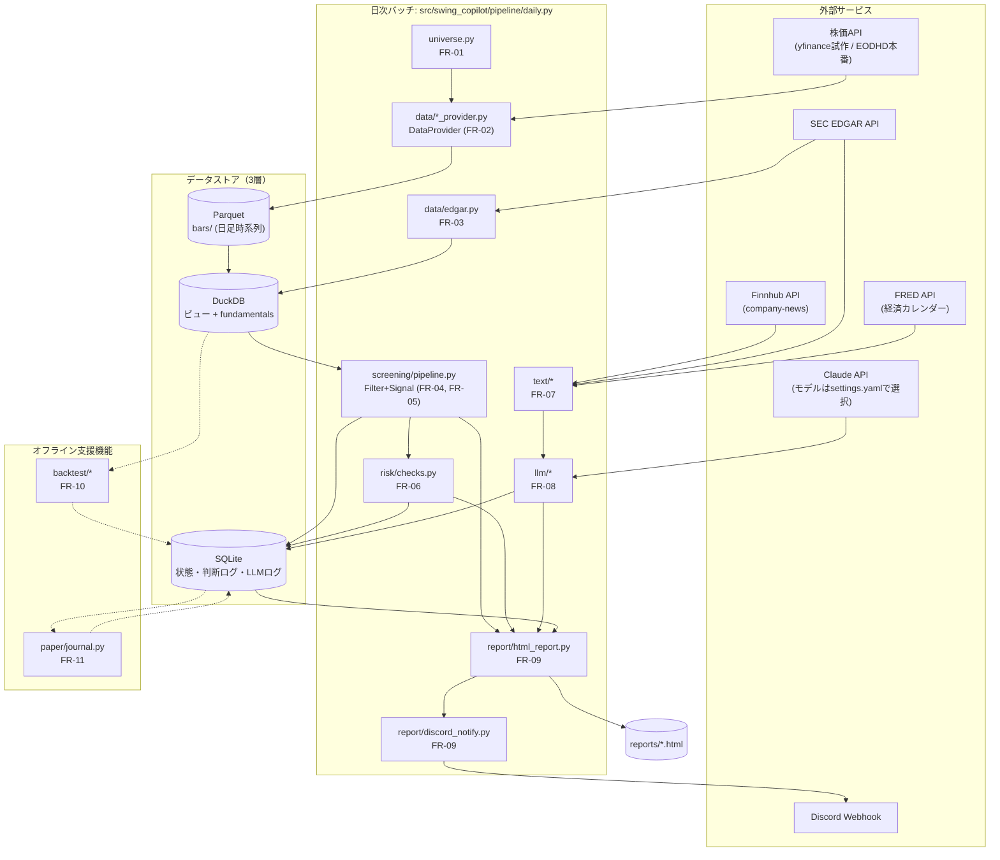
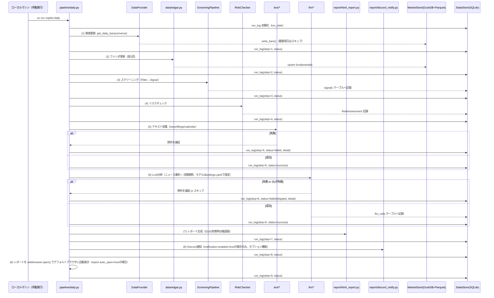

# 03. 基本設計書（swing-copilot）

## 1. 文書情報

| 項目 | 内容 |
|---|---|
| システム名（仮称） | swing-copilot |
| 対象範囲 | 米国株スイング〜ポジショントレードの意思決定支援システム（日次バッチ）。売買判断・発注は人間が行う。完全自動売買・証券会社API連携はスコープ外（CON-01）。 |
| 読者 | 本システムの詳細設計・実装を行う開発者・実装エージェント（Claude Codeの `/goal` による自律実装を含む） |
| 前提文書 | `docs/00_human_preparation.md`（人間の下準備）、`docs/01_requirements.md`（要件定義書、FR/NFR/CONのID定義元） |
| 後続文書 | `docs/04_detailed_design.md`（詳細設計書。本書のコンポーネント設計をモジュール・クラス・スキーマレベルまで具体化する） |
| バージョン | v1.0 |

本書は要件定義書（`docs/01_requirements.md`）で定義された要件ID（FR-01〜FR-12、NFR-01〜NFR-07、CON-01〜CON-04）を前提とし、それらを満たすシステム構成・データフロー・データストア・外部インターフェース・エラー処理方針・運用設計・セキュリティ設計を定める。要件そのものの再定義は行わない。

---

## 2. システム全体構成

swing-copilotは、利用者がローカルマシンで手動実行するコマンドを起点に、価格・ファンダメンタルズ・テキスト情報を外部APIから収集し、スクリーニング・リスクチェック・LLM分析を経てHTMLレポート（実行後に自動でブラウザ表示）とDiscord通知（オプション機能）を生成する、単一プロセスのバッチパイプラインである。証券会社APIとの接続や自動発注は行わない。

実行環境はローカルマシンのみであり、利用者が任意のタイミングで1日1回、同一のCLIエントリポイント（`uv run copilot-daily`）を手動実行する。GitHub Actions等による自動実行は行わない。`data/`（Parquet/DuckDB/SQLite）と`reports/`（HTML）はいずれもローカルファイルシステムのパスにそのまま永続化される。

---

## 3. コンポーネント一覧（責務・対応FR）

| コンポーネント | 主な配置 | 責務 | 対応FR/NFR |
|---|---|---|---|
| Universe管理 | `universe.py` | S&P500構成銘柄リストの取得・保存・更新 | FR-01 |
| DataProvider | `data/base.py`, `data/yfinance_provider.py`, `data/eodhd_provider.py` | 日足株価の取得を抽象化し、試作(yfinance)・本番(EODHD)を差し替え可能にする | FR-02, NFR-07, CON-02 |
| EDGARクライアント | `data/edgar.py` | SEC EDGAR公式APIから財務諸表・ファンダメンタルズを取得 | FR-03 |
| MarketStore | `storage/market_store.py` | 日足時系列（Parquet）・分析クエリ（DuckDB）の読み書き | FR-02, FR-03 |
| StateStore | `storage/state_store.py` | ポジション・判断ログ・LLM入出力ログ・実行ログ（SQLite）の読み書き | FR-11, NFR-05 |
| Filter/Signal基盤 | `screening/base.py` | フィルタ・シグナルのABCとプラガブルな登録レジストリ | FR-05, NFR-07 |
| ファンダフィルタ | `screening/fundamental_filters.py` | 第1段: 黒字継続・FCF・自己資本比率によるユニバース絞り込み | FR-04 |
| テクニカルシグナル | `screening/technical_signals.py` | 第2段: TA-Libによるトレンド・押し目・出来高シグナル評価 | FR-05 |
| ScreeningPipeline | `screening/pipeline.py` | `strategies.yaml`に従いフィルタ・シグナルを合成し候補を出力 | FR-04, FR-05, NFR-07 |
| RiskChecker | `risk/` | ポジションサイズ・セクター集中度・銘柄間相関等のリスクチェック | FR-06 |
| テキスト収集 | `text/` | ニュース（Finnhub）・適時開示（EDGAR 8-K/10-Q）・経済カレンダー（FRED）の収集 | FR-07 |
| LLMClient | `llm/client.py` | Claude API呼び出しの共通ラッパー（リトライ・コスト記録） | FR-08, NFR-05, NFR-06 |
| LLM分析（要約） | `llm/summarize.py` | LLMによるニュース要約（事実/推測分離、使用モデルは`settings.yaml`の`llm.models.news_summary`で設定、デフォルトHaiku） | FR-08 |
| LLM分析（決算解釈） | `llm/filings_analysis.py` | LLMによる決算書解釈（事実/推測分離、使用モデルは`settings.yaml`の`llm.models.filing_analysis`で設定、デフォルトHaiku。精度重視の場合はSonnet等へ設定変更可） | FR-08 |
| レポート生成 | `report/html_report.py` | Jinja2による日次HTMLレポート生成（実行後にデフォルトブラウザへ自動表示。ダークテーマ・TradingView Lightweight Chartsでのローソク足+SMA表示等のUI詳細は`docs/05_ui_design.md`参照） | FR-09 |
| Discord通知 | `report/discord_notify.py` | Discord Webhookへの通知送信（オプション機能、デフォルト無効） | FR-09 |
| バックテスト | `backtest/` | backtesting.pyによる戦略検証、SPY買い持ちとの比較 | FR-10 |
| ペーパートレード記帳 | `paper/journal.py` | 人間の判断（追随/見送り/修正）と仮想約定の記録 | FR-11, CON-04 |
| 日次オーケストレータ | `pipeline/daily.py` | 全ステップの実行順制御・冪等性・フェイルソフト | FR-12, NFR-04 |
| 設定ロード | `config.py` | `settings.yaml`/`strategies.yaml`/環境変数の統合ロード | NFR-06 |

---

## 4. データフロー（日次バッチのシーケンス）

`pipeline/daily.py` は以下の9ステップを固定順で実行する。ステップ(5)テキスト収集・(6)LLM分析が失敗しても、ステップ(7)(8)は「スクリーニング結果のみの縮退版」で完走する（フェイルソフト、FR-12・NFR-04）。同日に再実行された場合、取得済みのデータはスキップする（冪等性）。

---

## 5. データストア設計（3層の使い分け）

swing-copilotは目的別に3層のデータストアを使い分ける。

| 層 | 実体 | 役割 | 主な利用者 |
|---|---|---|---|
| ① Parquet | `data/bars/`（`year=YYYY`パーティション） | 日足時系列の生データを列指向で永続化。追記・大量読み出しに強い。 | DataProvider（書き込み）、DuckDB（読み出し元） |
| ② DuckDB | `data/market.duckdb` | Parquetへのビュー＋`fundamentals`テーブルを持つ分析クエリ層。SQLでの結合・集計をスクリーニング・バックテストから利用。 | screening/*, backtest/* |
| ③ SQLite | `data/state.sqlite` | トランザクション的な状態管理: ポジション、判断ログ、LLM入出力ログ、実行ログ、シグナル履歴。 | risk/*, llm/*, paper/*, report/*, pipeline/daily.py |

使い分けの原則:
- **時系列の大量データ（株価）はParquet**に列指向で永続化し、DuckDBはその上の「クエリビュー」として振る舞う（DuckDB自体に生データを二重persistしない）。
- **ファンダメンタルズ（四半期粒度・行数少）はDuckDBのテーブル**として直接保持する。
- **日々の意思決定に紐づく状態（ポジション・判断・ログ）はSQLite**に持ち、監査性（NFR-05: 全入出力記録）とトランザクション整合性を担保する。
- 3ストアとも`data/`配下に配置し、ローカルファイルシステムのパスとしてそのまま永続化する（実行環境がステートレスに破棄されることはないため、永続化のためのコミット操作は不要）。

---

## 6. 外部インターフェース一覧

### 6.1 データ取得系 外部API（4つ）＋Discord通知

| # | サービス | 用途 | エンドポイント種別 | 認証 | レート制限 |
|---|---|---|---|---|---|
| 1 | 株価API（yfinance試作 / EODHD本番） | 日足OHLCV取得 | yfinance: 非公式ライブラリ経由（キー不要）。EODHD: REST API（$19.99/月プラン） | yfinance: なし。EODHD: APIキー（クエリパラメータ、実装時に要確認） | yfinance: 明示的なSLAなし（過度な連打は避ける）。EODHD: プラン依存（実装時に要確認） |
| 2 | SEC EDGAR API | 財務諸表・ファンダメンタルズ、8-K/10-Q監視 | 公式REST API（edgartools経由） | 不要（ただしUser-Agentヘッダー必須: 氏名/アプリ名＋連絡先メールアドレス） | 10リクエスト/秒上限 |
| 3 | Finnhub API | ニュース収集（company-newsエンドポイント） | 公式REST API | APIキー（無料枠） | 60コール/分 |
| 4 | FRED API | 経済カレンダー・指標 | 公式REST API | APIキー（無料） | 明示的なSLAなし（実装時に要確認、常識的な間隔を空ける） |
| － | Discord Webhook | 日次レポート通知（オプション機能、デフォルト無効） | Webhook POST | Webhook URL自体が認証情報 | Discord側のWebhookレート制限（実装時に要確認） |

### 6.2 LLM API（Claude API）

上記4データAPI＋Discordとは別枠で、LLM分析を担うClaude APIを以下の通り整理する。

| 項目 | 内容 |
|---|---|
| 用途 | ニュース要約（FR-08前段）、決算書解釈（FR-08本体） |
| モデル | ニュース要約・決算書解釈とも`settings.yaml`の`llm.models`（`news_summary`/`filing_analysis`）で指定するモデルIDを使用する（コード変更不要で切替可能）。デフォルトはいずれも`claude-haiku-4-5-20251001`（$1/$5 per MTok）。精度が必要な場合は決算書解釈のモデルIDをSonnet等（例: $2/$10 per MTok、2026-09-01以降 $3/$15）へ設定変更できる |
| 認証 | `ANTHROPIC_API_KEY`（環境変数） |
| 出力形式 | 構造化JSON出力（`llm/schemas.py`のpydanticモデルに準拠） |
| レート制限・リトライ | 具体的なレート制限値はAPIキーのTierに依存するため実装時に要確認。`LLMClient`が指数バックオフ等のリトライを実装する（詳細は`docs/04_detailed_design.md`）。 |
| 監査記録 | 全呼び出しの入出力・トークン数・コストをSQLite `llm_calls`テーブルへ記録（NFR-05） |

---

## 7. エラー処理・フェイルソフト方針

- **フェイルソフトの原則（FR-12・NFR-04）**: 日次バッチはステップ(5)テキスト収集・(6)LLM分析が失敗しても、ステップ(7)レポート生成・(8)Discord通知は「スクリーニング＋リスクチェック結果のみの縮退版」として必ず完走する。これにより、外部テキストAPIやLLM APIの障害時でも、その日のスクリーニング結果を確実に人間へ届ける。
- **各ステップの結果記録**: 9ステップそれぞれの成否・詳細・所要時間を`run_log`テーブル（SQLite）に記録する（NFR-05: 監査性）。ステップ失敗時は例外を捕捉し、後続ステップの実行可否を判断した上で処理を継続する（バッチ全体を異常終了させない。ただし(1)〜(4)の失敗はスクリーニング自体が成立しないため、後続を打ち切りログのみ記録して終了する）。
- **冪等性**: 同日に再実行された場合、既に取得済みのデータ（当日の株価・当日分のファンダ・当日分のニュース等）は再取得をスキップする。判定はMarketStore/StateStoreに記録済みの日付キーで行う。
- **欠損検知・リトライ（NFR-04）**: DataProvider・LLMClient等、外部I/Oを伴うコンポーネントはリトライ機構を持つ。個別銘柄の取得失敗はバッチ全体を止めず、失敗銘柄をリストとして返し（例: yfinance実装）、後続処理は成功分のみで進める。
- **断定的売買指示の禁止（CON-03）**: LLM出力スキーマは事実（`facts`）と推測（`interpretation`）をフィールドレベルで分離することを強制し、レポート・プロンプト双方でエラーとは独立にこの制約を担保する（詳細は`docs/04_detailed_design.md`のLLMプロンプト設計）。

---

## 8. 運用設計

### 8.1 実行環境

| 環境 | 用途 | 実行方法 |
|---|---|---|
| ローカルマシン | 開発・デバッグ・日々の運用のすべてを同一方法で実行 | 利用者が任意のタイミングで1日1回`uv run copilot-daily`を手動実行する（`.env`から環境変数をロード） |

### 8.2 永続化

すべてのデータはローカルファイルシステムのパスにそのまま永続化される。実行環境がステートレスに破棄されることはないため、永続化のためのコミット操作は不要である。
- `data/`（Parquet: `bars/`、DuckDB: `market.duckdb`、SQLite: `state.sqlite`）
- `reports/`（当日分のHTMLレポート）

日次バッチの最終ステップ(9)では、生成したレポートを`webbrowser.open()`でデフォルトブラウザに自動表示する（`settings.yaml`の`report.auto_open`、デフォルト`true`）。

### 8.3 実行時間

NFR-03「35分以内」を満たすため、各ステップの`duration_s`を`run_log`に記録し、継続的にボトルネックを監視する。S&P500全銘柄（約500銘柄）に対する外部API呼び出しはレート制限（EDGAR 10req/秒、Finnhub 60コール/分）の制約を受けるため、以下の方針で時間短縮を図る（発注者確定仕様）。

- 価格取得: yfinanceの一括ダウンロード（500銘柄バッチ）を用い、銘柄ごとの個別リクエストを避ける。
- ファンダメンタルズ更新: 週1回、かつ前回取得以降に新規filingがある銘柄のみを対象とする増分更新とする。
- ニュース取得・LLM分析: 保有銘柄＋当日のスクリーニング候補銘柄の合計最大30銘柄に対象を限定する。
- SEC EDGARアクセス: 10リクエスト/秒の上限を守るスロットリングを実装する。

実装後の実測に基づく追加チューニング（並列化要否等）は`docs/04_detailed_design.md`の該当モジュール（3.2, 3.4, 3.6, 3.14節）を参照。

### 8.4 監視

- 実行結果は`run_log`テーブルに全ステップ記録される。実行時の終了コード・標準出力ログに加え、`run_log`の内容をレポート末尾や別途の要約で確認できるようにする（具体的な可視化手段は実装時に検討）。
- Discord通知を有効にしている場合、通知はレポート配信を兼ねた簡易な死活監視としても機能する（通知が来ない＝バッチ未完走のシグナルになる）。ただし通知はオプション機能であり、無効時（デフォルト）はこの用途には使えない。

---

## 9. セキュリティ設計

- **APIキー管理（NFR-06）**: `ANTHROPIC_API_KEY`, `FINNHUB_API_KEY`, `FRED_API_KEY`, `DISCORD_WEBHOOK_URL` はすべて環境変数として扱い、ローカルの`.env`（`.gitignore`対象、python-dotenvで読み込み、`.env.example`に項目のみ記載）から読み込む。`DISCORD_WEBHOOK_URL`は通知（オプション機能）を有効にする場合のみ設定する。
- **コードへの秘密情報のハードコード禁止**: `settings.yaml`・`strategies.yaml`等の設定ファイルにはAPIキー・Webhook URLを直接記載しない。`config.py`（pydantic-settings）が環境変数を優先的に読み込む。
- **リポジトリの公開範囲**: GitHubリポジトリを利用する場合（コード管理用、利用自体は任意）はプライベートで運用する（`docs/00_human_preparation.md`項目5に対応）。
- **SEC EDGAR User-Agent**: 規約上必須のUser-Agentヘッダーには氏名またはアプリ名＋連絡先メールアドレスを設定する（個人情報の取り扱いに留意）。
- **LLM入出力ログの取り扱い**: `llm_calls`テーブルにプロンプト・レスポンス全文を記録するため（NFR-05）、当該データが機微情報を含まないことを前提とする。リポジトリがプライベートである前提と組み合わせて運用する。
- **監査性と秘密情報の分離**: `run_log`・`llm_calls`等の監査ログにAPIキー自体が記録されないよう、ログ出力箇所でシークレット値をマスクする実装方針とする（詳細は`docs/04_detailed_design.md`）。

---

## 10. 要件トレーサビリティ表

| 要件ID | 概要 | 対応コンポーネント |
|---|---|---|
| FR-01 | ユニバース管理 | `universe.py` |
| FR-02 | 株価取得・保存（Provider差し替え可） | `data/base.py`, `data/yfinance_provider.py`, `data/eodhd_provider.py`, `storage/market_store.py` |
| FR-03 | EDGARファンダ取得 | `data/edgar.py`, `storage/market_store.py` |
| FR-04 | ファンダ品質フィルタ（第1段） | `screening/fundamental_filters.py`, `screening/pipeline.py` |
| FR-05 | テクニカルシグナル（第2段・プラガブル） | `screening/technical_signals.py`, `screening/base.py`, `screening/pipeline.py` |
| FR-06 | リスク管理チェック | `risk/position_sizing.py`, `risk/checks.py` |
| FR-07 | テキスト収集 | `text/news_finnhub.py`, `text/edgar_filings.py`, `text/calendar_fred.py` |
| FR-08 | LLM分析（事実/推測分離） | `llm/client.py`, `llm/schemas.py`, `llm/summarize.py`, `llm/filings_analysis.py` |
| FR-09 | HTMLレポート＋Discord通知 | `report/html_report.py`, `report/discord_notify.py` |
| FR-10 | バックテスト（対S&P500） | `backtest/strategies.py`, `backtest/runner.py` |
| FR-11 | ペーパートレード記録 | `paper/journal.py`, `storage/state_store.py` |
| FR-12 | 日次バッチ（冪等・フェイルソフト） | `pipeline/daily.py` |
| NFR-01 | コスト（試作月$5以内） | `llm/client.py`（コスト記録）、モデル選定（`settings.yaml`の`llm.models`設定、デフォルト全Haiku） |
| NFR-02 | 1人保守 | 全体アーキテクチャ（シンプルな単一バッチ構成、`config.py`による設定一元化） |
| NFR-03 | 35分以内 | `pipeline/daily.py`（`run_log`による所要時間計測） |
| NFR-04 | 欠損検知・リトライ | `data/*_provider.py`, `llm/client.py`, `pipeline/daily.py`（フェイルソフト） |
| NFR-05 | 監査性（全入出力記録） | `storage/state_store.py`（`llm_calls`, `run_log`, `signals`, `trades_journal`） |
| NFR-06 | キー管理 | `config.py`, `.env`（python-dotenv） |
| NFR-07 | インターフェース分離（Strategy/Filter/Signal/DataProvider/Notifier） | `data/base.py`, `screening/base.py`, `screening/pipeline.py`（Strategy）, `report/discord_notify.py`（Notifier、オプション機能） |
| NFR-08 | テスト品質（カバレッジ95%以上・E2Eスモーク） | テスト戦略全体（`docs/04_detailed_design.md` 8章）、`pyproject.toml`/justfileのカバレッジ設定 |
| CON-01 | 発注自動化なし | アーキテクチャ全体（証券会社API未接続） |
| CON-02 | yfinance試作限定 | `data/yfinance_provider.py`（P1〜P3）、`data/eodhd_provider.py`（P4） |
| CON-03 | 断定的売買指示を出力しない | `llm/schemas.py`（facts/interpretation分離）、LLMプロンプト設計 |
| CON-04 | ペーパートレード検証ゲート | `paper/journal.py` |
